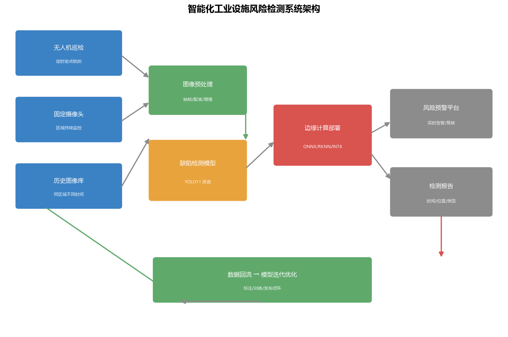

# industrial-facility-risk-detection

**智能化工业设施风险检测系统 —— 校企项目技术路线脱敏复现（作品集/框架级）**

> 本项目源于一份**校企科研立项任务书**《智能化工业设施风险检测系统》的公开技术路线复现。
> ⚠️ **脱敏声明**：原任务书含企业名称、预算明细与密级字段，**原文不得公开**；本仓库仅复现其**通用技术路线**
> （无人机/固定摄像头巡检 + 深度学习缺陷检测 + 边缘计算部署），使用公开/替代数据验证框架，不含任何涉密内容。

---

## 项目背景（脱敏）

| 原需求点 | 说明 |
|---|---|
| 巡检对象 | 石化/工业场景的线缆槽盒盖缺失、管道受损、料堆坍塌等设施隐患 |
| 采集方式 | 无人机定时定点巡检 + 固定摄像头补充 |
| 检测任务 | 缺陷/缺失目标检测（bbox + 类别），支持边缘部署与实时预警 |
| 交付物 | 检测系统软件、设计报告、风险检测报告功能；配套知识产权与论文 |

## 技术路线（复现口径）



- **检测引擎**：复用开源的钢轨缺陷 YOLO11 改进工程 [`rail-surface-defect-yolo11`](https://github.com/zych2002918/rail-surface-defect-yolo11)
  （含 LSDECD 检测头 / FDPN / ODConv / 通道剪枝等改进模块），作为缺陷检测基座
- **轻量化/注意力可选增强**（对应任务书改进方向）：Ghost/MobileNetV3 轻量主干、SE/CBAM/BiFormer 注意力、
  DyHead 检测头、MPDIoU 损失等——按部署平台算力酌情启用
- **边缘部署**：PyTorch → ONNX → RKNN(瑞芯微) / TensorRT，量化后适配边缘设备
- **闭环迭代**：边缘侧回传误检/漏检样本 → 重新标注训练 → 发布新版模型（持续优化）

## 仓库结构

```
industrial-facility-risk-detection/
├── docs/
│   ├── 技术方案_脱敏.md        # 完整技术方案（需求/算法/数据/部署）
│   └── 参赛转化建议.md         # → race 工作区：赛事适配与材料清单
├── data/
│   └── defects_sample.yaml     # 目标类别定义 + 公开替代数据指引
├── scripts/
│   ├── prepare_data.py         # 公开数据下载/格式转换引导
│   ├── train.py                # 训练入口（薄封装，调用检测引擎）
│   ├── detect.py               # 推理入口
│   └── export_onnx.py          # ONNX 导出（边缘部署第一步）
├── requirements.txt
├── LICENSE (MIT, 自研部分)
└── README.md
```

## 快速开始

```bash
# 1. 克隆检测引擎（改进版 ultralytics）
git clone https://github.com/zych2002918/rail-surface-defect-yolo11.git engines/rail-yolo11

# 2. 安装依赖（引擎自带 ultralytics 改进包，无需 pip 安装 ultralytics）
pip install -r requirements.txt
pip install -r engines/rail-yolo11/requirements.txt

# 3. 数据准备（公开替代数据，见 docs/技术方案_脱敏.md 与 data/defects_sample.yaml）
python scripts/prepare_data.py --dataset neu-det --root ./datasets

# 4. 训练 / 推理
python scripts/train.py --engine engines/rail-yolo11 --data data/defects_sample.yaml --epochs 100
python scripts/detect.py --engine engines/rail-yolo11 --weights runs/train/exp/weights/best.pt --source <视频或图片>

# 5. 边缘部署
python scripts/export_onnx.py --engine engines/rail-yolo11 --weights runs/train/exp/weights/best.pt --imgsz 640
```

## 许可

- 自研部分（本仓库脚本/文档）：**MIT**
- 检测引擎 `rail-surface-defect-yolo11`：自研改进 MIT + Ultralytics 上游 AGPL-3.0

> 若基于本项目参加竞赛/发表论文：须遵守数据来源方许可，并按校企协议处理（具体口径咨询课题负责人）。